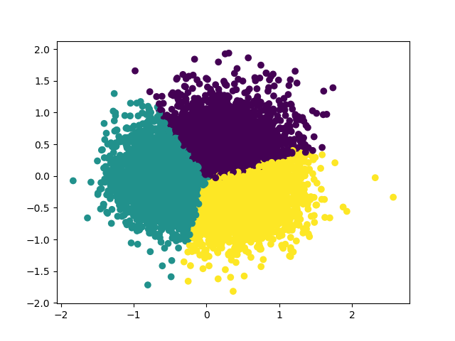
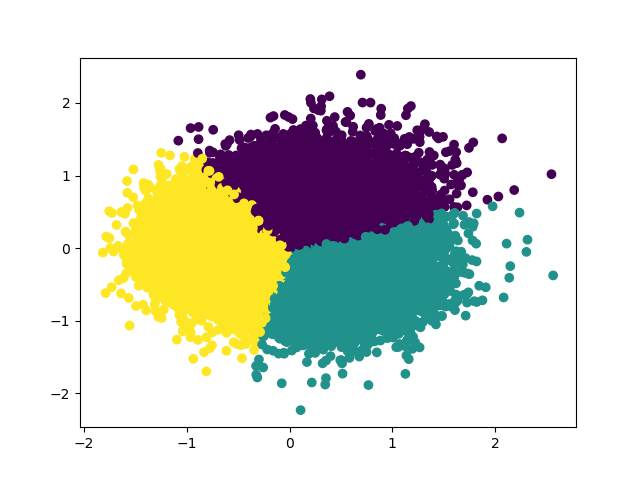

# apr_movie
集成了：电影观看，管理，推荐
# 技术栈
* Flask
* Vue
* MySQL
# 电影推荐
目前使用的 apriori,svd
# 进展
* 导入 ml20 数据集,此数据集包含 20million 评分数据,20k movie.
    * 在导入的时候发现遍历插入速度太慢了(一个小时也没搞完,内存占到了 40G,直接杀掉了),.
    * 后面使用 pandas 的 to_sql 导入,导入完在修改 schema 吧
* 使用 redis 做页面访问次数统计
* 训练了 SVD 模型，使用 SVD 分解后的用户矩阵和 item 矩阵进行了Kmeans 聚类

movie cluster

user cluster

    
