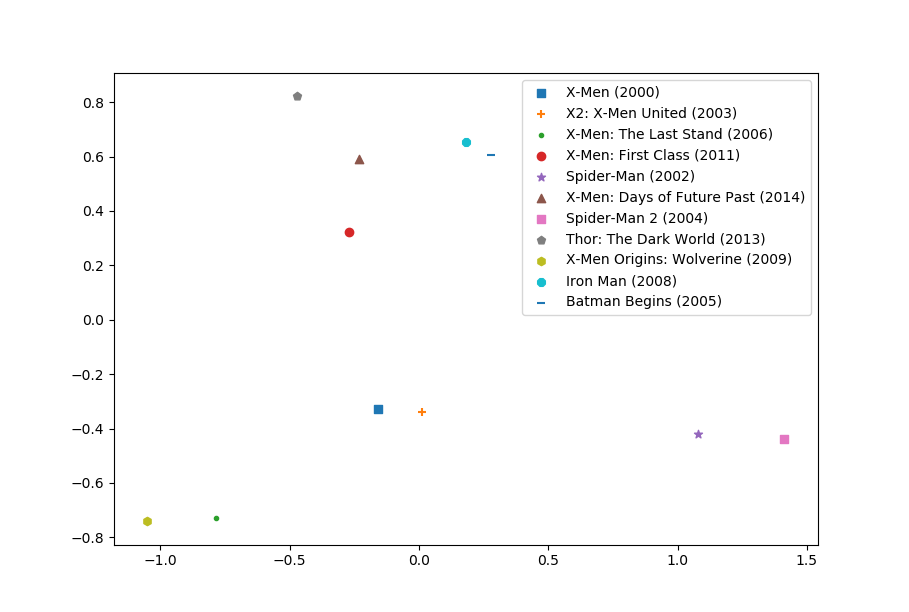

# Movie Recommend
电影推荐算法：Apriori 算法、SVD（奇异值分解）推荐算法
* 电影、用户可视化
* 电影、用户管理
* 数据统计

# 数据
MovieLens 20M Dataset: [MovieLens 20M Dataset | GroupLens](https://grouplens.org/datasets/movielens/20m/)
Column | Nums
---- | ---
User | 138,493
Movie |  27,278
Rating | 20,000,264
# 相关技术
* Flask
* Vue
* MySQL
* Redis
* SVD, Apriori, K-Means, PCA
# 电影推荐
目前使用的 Apriori, SVD。 后续可能添加新的算法。
# 进展
* 导入 ml20 数据集,此数据集包含 20million 评分数据,20k movie.
    * 在导入的时候发现遍历插入速度太慢了(一个小时也没搞完,内存占到了 40G,直接杀掉了),.
    * 后面使用 pandas 的 to_sql 导入,导入完在修改 schema 吧
* 使用 Flask 的 Blueprint 重构了各个模块
* 训练了 SVD 模型，使用 SVD 分解后的用户矩阵和 item 矩阵进行了Kmeans 聚类
# SVD 推荐
## 根据电影打分进行推荐
使用 svd 模型计算用户对未评分的电影打分，返回前 n 个打分最高的电影作为推荐结果
> n = 30 for now
## 使用相似电影进行推荐
根据用户最喜欢的前 K 部电影，分别计算这 K 部电影的相似电影 n 部，返回 K*n 部电影进行推荐
> K = 10 and n = 5 for now
## 根据相似用户进行推荐
获取相似用户 K 个，分别取这 K 个用户的最喜爱电影 n 部，返回 K*n 部电影进行推荐
> K = 10 and n = 5 for now
# Redis
## 使用 Redis 做页面访问次数统计
## 缓存相似电影
在使用相似电影推荐的方式时，每次请求大概需要 6.6s（需要遍历计算与所有电影的相似度）。
将相似电影存储至 redis 中（仅存储 movie_id,拿到 movie_id 后还是从 mysql 中获取电影详细信息), 时间缩短至：93ms。
十部电影，每部存 top 5 similar movie
登录了 1-6 user并使用了推荐系统，redis 中新增了 50 部电影的 similar movie，也就是说，系统只为 6 为用户计算了共 60 部电影的相似度，其中就有10 部重复电影。
热点电影重复度还是比较高的
## 缓存相似用户
# Top similar movie
使用 svd 分解后的电影矩阵进行计算相似电影，下图是与电影**X-Men (2000)** 相似度最高的前 10 部电影。

# 聚类
SVD 分解后的用户矩阵和 item 矩阵进行了K-means 聚类,PCA降维后进行可视化展示
## Movie Cluster

## User Cluster

    
# TODO
* 根据电影打分进行推荐速度太慢了. 32s
> 之前代码写的有误，时间全浪费在 fetch data 上了，在对所有电影评分的时候不fetch movie detail，排序完后再获取指定 n 部信息并返回。时间大约 1s